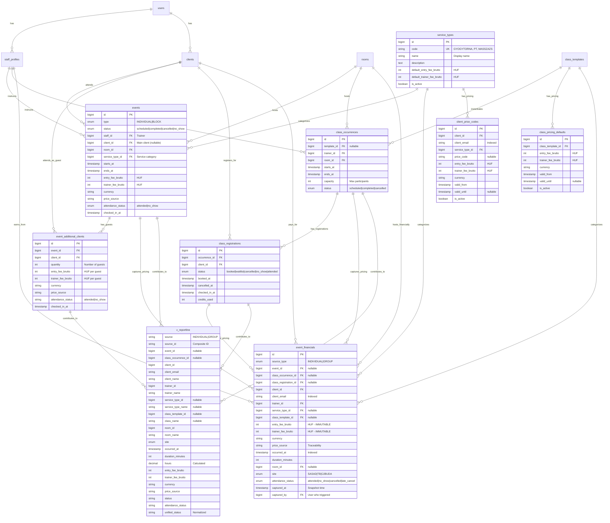

# Reports Module - Entity Relationship Diagram

## Mermaid ER Diagram



## Diagram Legend

### Cardinality
- `||--o{` : One-to-Many (1:N)
- `||--||` : One-to-One (1:1)
- `}o--o{` : Many-to-Many (N:M)

### Entity Types
- **Blue boxes**: Core domain entities (users, clients, staff)
- **Green boxes**: Event entities (events, class_occurrences)
- **Yellow boxes**: Pricing configuration (service_types, client_price_codes, class_pricing_defaults)
- **Red box**: NEW - event_financials (immutable snapshot)
- **Purple box**: NEW - v_reportline (unified view)

### Key Relationships

#### Individual Events (1:1)
```
staff_profiles ──> events <── clients
                     │
                     └──> event_additional_clients <── clients
```

#### Group Classes
```
staff_profiles ──> class_occurrences <── class_templates
                          │
                          └──> class_registrations <── clients
```

#### Financial Snapshots
```
events ──────────┐
                 │
event_additional │
clients ─────────┼──> event_financials <── staff_profiles
                 │                    │
class_           │                    └── clients
occurrences ─────┘
```

### Critical FK Chains

1. **Individual Event Pricing Flow**:
   ```
   events.service_type_id -> service_types
   events.client_id -> clients -> client_price_codes -> service_type_id
   events -> event_financials (snapshot)
   ```

2. **Group Class Pricing Flow**:
   ```
   class_occurrences.template_id -> class_templates -> class_pricing_defaults
   class_registrations -> event_financials (snapshot)
   ```

3. **Reporting Query Path**:
   ```
   v_reportline (UNION of events + class_occurrences)
   OR
   event_financials (pre-captured immutable data)
   ```

## Indexes Summary

### event_financials (NEW)
- `idx_financials_trainer_time` (trainer_id, occurred_at, deleted_at)
- `idx_financials_client_time` (client_id, occurred_at, deleted_at)
- `idx_financials_room_time` (room_id, occurred_at, deleted_at)
- `idx_financials_service_type_time` (service_type_id, occurred_at, deleted_at)
- `idx_financials_site_time` (site, occurred_at, deleted_at)
- `idx_financials_attendance` (attendance_status, occurred_at, deleted_at)
- `idx_financials_source_type` (source_type, occurred_at, deleted_at)
- `idx_financials_client_email` (client_email, occurred_at)
- `idx_financials_captured_at` (captured_at)

### events (ENHANCED)
- `idx_events_service_type_time` (service_type_id, starts_at, ends_at, deleted_at) **NEW**

### class_registrations (ENHANCED)
- `idx_class_registrations_client_time` (client_id, booked_at, deleted_at) **NEW**

### event_additional_clients (ENHANCED)
- `idx_eac_attendance` (attendance_status) **NEW**

## Data Flow: Pricing Capture

### Trigger: Event Attendance Marked

```
┌─────────────────────────────────────────────────────────────┐
│ User marks attendance: attended / no_show                    │
└────────────┬────────────────────────────────────────────────┘
             │
             ├─── INDIVIDUAL EVENT ───┐
             │                        │
             │    1. Read events.entry_fee_brutto,
             │       trainer_fee_brutto, service_type_id
             │    2. If event_additional_clients exist,
             │       read their pricing too
             │    3. Create event_financials record(s)
             │       with source_type='INDIVIDUAL'
             │
             └─── GROUP CLASS ───────┐
                                     │
                  1. Read class_occurrences.template_id
                  2. Query class_pricing_defaults for
                     valid_from <= occurred_at
                  3. For each class_registration:
                     Create event_financials record
                     with source_type='GROUP'
```

### Data Immutability Guarantee

Once `event_financials.captured_at` is set:
- **NEVER UPDATE** entry_fee_brutto or trainer_fee_brutto
- **NEVER RECALCULATE** based on current pricing rules
- Only allow soft delete (deleted_at) if correction needed
- Create NEW record if data was incorrect

## Query Patterns

### Pattern 1: Real-Time Reporting (v_reportline)
**Use Case**: Dashboard, recent events, live data
**Query**: `SELECT * FROM v_reportline WHERE occurred_at >= ?`
**Performance**: Depends on base table indexes (good for recent data)

### Pattern 2: Historical Reporting (event_financials)
**Use Case**: Month-end reports, audits, historical analysis
**Query**: `SELECT * FROM event_financials WHERE occurred_at BETWEEN ? AND ?`
**Performance**: Excellent (pre-aggregated, indexed)

### Pattern 3: Hybrid Approach
**Use Case**: Current month + historical comparison
```sql
-- Current month: live data from view
SELECT * FROM v_reportline
WHERE occurred_at >= '2025-12-01' AND occurred_at < '2025-12-31'

-- Previous months: snapshot data
SELECT * FROM event_financials
WHERE occurred_at >= '2025-01-01' AND occurred_at < '2025-12-01'
```

## Migration Order

**CRITICAL: Run migrations in this exact order:**

1. `2025_12_12_100001_create_event_financials_table.php`
2. `2025_12_12_100002_add_report_indexes_to_existing_tables.php`
3. `2025_12_12_100003_create_reportline_view.php`

**Dependencies:**
- event_financials depends on: events, class_occurrences, class_registrations, clients, staff_profiles, service_types, class_templates, rooms, users
- v_reportline depends on: all above tables + event_additional_clients, class_pricing_defaults

## Rollback Strategy

```bash
# Rollback in reverse order
php artisan migrate:rollback --step=3
```

**Order:**
1. Drop v_reportline view (no data loss)
2. Drop indexes from existing tables (no data loss)
3. Drop event_financials table (DATA LOSS - snapshot data deleted)

**WARNING**: Rolling back event_financials will delete all captured financial snapshots. Ensure backups exist before rollback.
