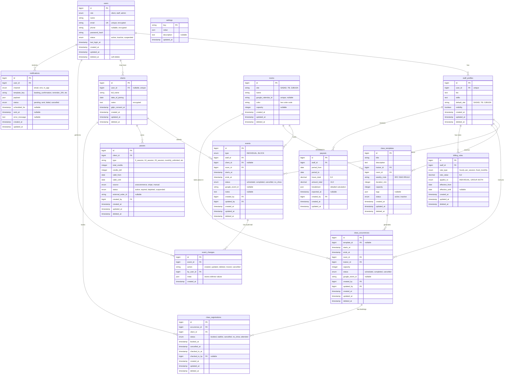

# FunctionalFit Calendar - Entity Relationship Diagram

## Overview
This document describes the complete database schema for the FunctionalFit booking and calendar management system. The database is designed with InnoDB engine, utf8mb4_unicode_ci character set, and stores all timestamps in UTC (displayed in Europe/Budapest timezone).

## ER Diagram (Mermaid)



## Table Descriptions

### Core User Tables

#### users
Master authentication table for all system users. Role-based access control (RBAC) starts here.
- **Role Enum**: `client`, `staff`, `admin`
- **Status Enum**: `active`, `inactive`, `suspended`
- **Security**: Email encrypted, phone encrypted if provided, password_hash using Argon2id
- **Soft Delete**: Yes (maintains referential integrity in audit logs)

#### staff_profiles
Extended profile for staff members linked to users table.
- **user_id**: Unique FK to users table
- **default_site**: Primary location (SASAD, TB, ÚJBUDA)
- **visibility**: Controls whether staff appears in client-facing selections
- **Soft Delete**: Yes

#### clients
Client records, may or may not have user accounts.
- **user_id**: Nullable FK (allows manual client creation without login)
- **notes**: Encrypted PII field for trainer notes
- **gdpr_consent_at**: Tracks GDPR compliance
- **Soft Delete**: Yes

### Resource Tables

#### rooms
Physical or virtual spaces for events and classes.
- **site**: Location identifier (SASAD, TB, ÚJBUDA)
- **google_calendar_id**: Maps to external Google Calendar resource
- **capacity**: Nullable (not all rooms have strict capacity limits)
- **color**: UI visualization (hex format)
- **Soft Delete**: Yes

### Event Tables

#### events
Individual 1:1 sessions and block times (maintenance, closures).
- **Type Enum**: `INDIVIDUAL`, `BLOCK`
- **Status Enum**: `scheduled`, `completed`, `cancelled`, `no_show`
- **client_id**: Nullable (BLOCK events don't have clients)
- **google_event_id**: External sync reference
- **Constraints**: starts_at < ends_at, no overlapping room/staff bookings
- **Indexes**: Composite (room_id, starts_at, ends_at), (staff_id, starts_at)
- **Soft Delete**: Yes

#### event_changes
Immutable audit log for all event modifications.
- **action**: `created`, `updated`, `deleted`, `moved`, `cancelled`
- **meta**: JSON containing old and new values for changed fields
- **No Soft Delete**: Audit records are permanent

### Class Tables

#### class_templates
Recurring group class definitions with RRULE patterns.
- **weekly_rrule**: RFC 5545 recurrence rule (e.g., "FREQ=WEEKLY;BYDAY=MO,WE,FR")
- **tags**: JSON array for categorization (e.g., ["yoga", "beginner", "morning"])
- **Status Enum**: `active`, `inactive`
- **Soft Delete**: Yes

#### class_occurrences
Individual instances of group classes (generated from templates or standalone).
- **template_id**: Nullable (allows one-off classes)
- **Status Enum**: `scheduled`, `completed`, `cancelled`
- **capacity**: Can override template capacity
- **Indexes**: (starts_at, ends_at), (room_id, starts_at, ends_at)
- **Soft Delete**: Yes

#### class_registrations
Client bookings for class occurrences.
- **Status Enum**: `booked`, `waitlist`, `cancelled`, `no_show`, `attended`
- **checked_in_by**: Staff member who marked attendance
- **Constraints**: Unique (occurrence_id, client_id) where deleted_at IS NULL
- **Indexes**: (occurrence_id, status), (client_id, created_at)
- **Soft Delete**: Yes

### Pass and Billing Tables

#### passes
Client credit/membership passes for booking classes.
- **type**: Descriptive string (5_session, 10_session, monthly_unlimited, etc.)
- **credits_left**: Must be >= 0 (CHECK constraint)
- **Source Enum**: `woocommerce`, `stripe`, `manual`
- **Status Enum**: `active`, `expired`, `depleted`, `suspended`
- **external_order_id**: Reference to payment system order
- **Indexes**: (client_id, status, valid_until), (external_order_id)
- **Soft Delete**: Yes

#### billing_rules
Staff compensation rates.
- **Rate Type Enum**: `hourly`, `per_session`, `fixed_monthly`
- **Applies To Enum**: `INDIVIDUAL`, `GROUP`, `BOTH`
- **effective_from/until**: Date ranges allow rate history tracking
- **Indexes**: (staff_id, effective_from)
- **Soft Delete**: Yes

#### payouts
Generated compensation records for staff.
- **breakdown**: JSON containing detailed calculation (hours, rate, adjustments)
- **exported_at**: Tracks when payout was sent to accounting
- **Indexes**: (staff_id, period_from), (exported_at)
- **No Soft Delete**: Financial records are immutable (use void/adjustment records)

### System Tables

#### notifications
Queued and sent notifications.
- **Channel Enum**: `email`, `sms`, `in_app`
- **Status Enum**: `pending`, `sent`, `failed`, `cancelled`
- **template_key**: References notification template (booking_confirmation, reminder_24h, etc.)
- **scheduled_for**: Allows future scheduling
- **Indexes**: (status, scheduled_for), (user_id, created_at)
- **No Soft Delete**: Retain full notification history

#### settings
Global configuration key-value store.
- **key**: Primary key (e.g., "cancellation_policy_hours", "credit_deduction_timing")
- **value**: JSON for complex configurations
- **No Soft Delete**: Settings are updated, not deleted

## Critical Indexes

### Collision Detection
- `events`: INDEX `idx_collision_room` (room_id, starts_at, ends_at)
- `events`: INDEX `idx_collision_staff` (staff_id, starts_at, ends_at)
- `class_occurrences`: INDEX `idx_collision_room` (room_id, starts_at, ends_at)

### Time-Range Queries
- `events`: INDEX `idx_time_range` (starts_at, ends_at)
- `class_occurrences`: INDEX `idx_time_range` (starts_at, ends_at)

### Foreign Key Performance
- All FK columns have indexes (automatically created by Laravel)

### Reporting Queries
- `class_registrations`: INDEX `idx_reporting` (occurrence_id, status, checked_in_at)
- `passes`: INDEX `idx_active_passes` (client_id, status, valid_until)
- `payouts`: INDEX `idx_accounting` (staff_id, period_from, exported_at)

## Constraints

### Database-Level Constraints

1. **Email Uniqueness**: `users.email` UNIQUE
2. **Pass Credits**: `passes.credits_left >= 0` CHECK constraint
3. **Time Validity**: Application enforces `starts_at < ends_at` (trigger if supported)
4. **Soft Delete Unique Constraints**: Use filtered indexes where `deleted_at IS NULL`

### Application-Level Constraints (Laravel Policies)

1. **Collision Prevention**: Before inserting event/occurrence, check for overlaps
2. **Same-Day Move Rule**: Staff can only move events within same calendar day
3. **Capacity Limits**: Bookings cannot exceed room/class capacity (unless admin override)
4. **Pass Validation**: Sufficient credits before allowing booking
5. **Role-Based Permissions**: RBAC enforced via Laravel Policies

## Collision Detection Logic

### Room Collision Query
```sql
SELECT COUNT(*) FROM events
WHERE room_id = ?
  AND deleted_at IS NULL
  AND status NOT IN ('cancelled')
  AND (
    (starts_at < ? AND ends_at > ?) OR  -- new event starts during existing
    (starts_at < ? AND ends_at > ?) OR  -- new event ends during existing
    (starts_at >= ? AND ends_at <= ?)   -- new event contains existing
  )
```

### Staff Collision Query
```sql
SELECT COUNT(*) FROM events
WHERE staff_id = ?
  AND deleted_at IS NULL
  AND status NOT IN ('cancelled')
  AND (
    (starts_at < ? AND ends_at > ?) OR
    (starts_at < ? AND ends_at > ?) OR
    (starts_at >= ? AND ends_at <= ?)
  )
```

## Migration Order

Migrations must be created in dependency order:

1. `users` (no dependencies)
2. `rooms` (no dependencies)
3. `staff_profiles` (depends on users)
4. `clients` (depends on users)
5. `events` (depends on users, staff_profiles, clients, rooms)
6. `event_changes` (depends on events, users)
7. `class_templates` (depends on staff_profiles, rooms)
8. `class_occurrences` (depends on class_templates, staff_profiles, rooms, users)
9. `class_registrations` (depends on class_occurrences, clients, users)
10. `passes` (depends on clients, users)
11. `billing_rules` (depends on staff_profiles)
12. `payouts` (depends on staff_profiles, users)
13. `notifications` (depends on users)
14. `settings` (no dependencies)

## Data Integrity Rules

### Referential Integrity
- All foreign keys use `ON DELETE RESTRICT` by default
- Exceptions (using `ON DELETE CASCADE`):
  - `staff_profiles.user_id` → `users.id` (CASCADE)
  - `event_changes.event_id` → `events.id` (CASCADE - audit trail follows event)

### Soft Deletes
Tables with soft deletes maintain referential integrity while hiding records from normal queries. Use `withTrashed()` in Eloquent when needed for audit purposes.

### Timezone Handling
- **Storage**: All TIMESTAMP columns store UTC
- **Display**: Application converts to Europe/Budapest (UTC+1/+2 depending on DST)
- **Input**: Application converts Europe/Budapest to UTC before storage

## Security Considerations

### Encrypted Columns
The following columns contain PII and should be encrypted using Laravel's encryption:
- `users.email`
- `users.phone`
- `clients.notes`

### Password Hashing
- `users.password_hash` uses Argon2id (Laravel default as of PHP 8.3)

### Audit Trail
- All critical changes to `events` are logged in `event_changes`
- `created_by` and `updated_by` columns track who made changes
- Notification history provides complete communication audit

## Denormalization Strategy

This schema follows 3NF (Third Normal Form) with NO intentional denormalizations. Performance optimizations rely on:
1. Strategic indexing
2. Query optimization
3. Caching layer (Redis)
4. Read replicas for reporting (if needed at scale)

Any future denormalization must be documented here with clear justification.
