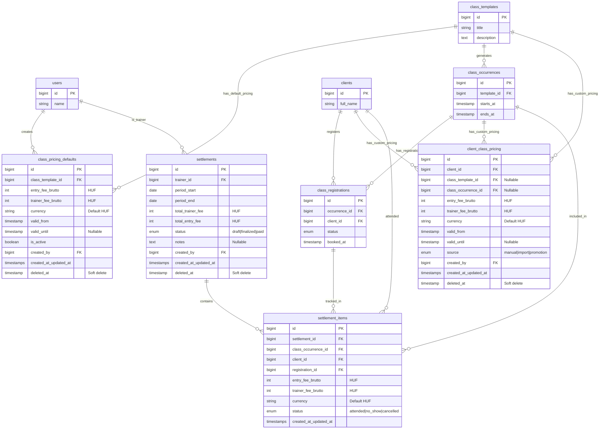
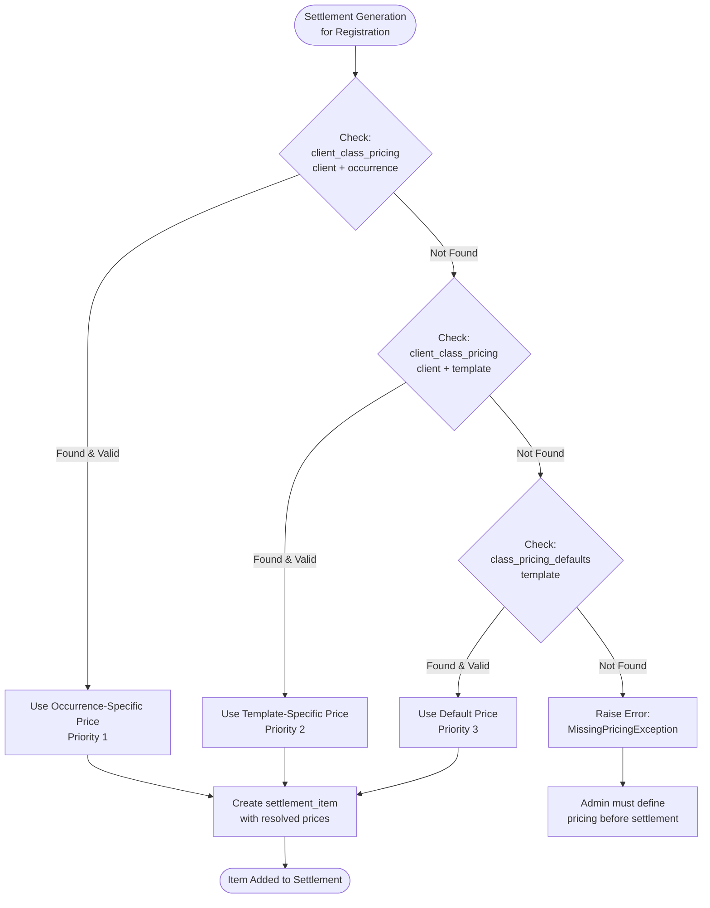
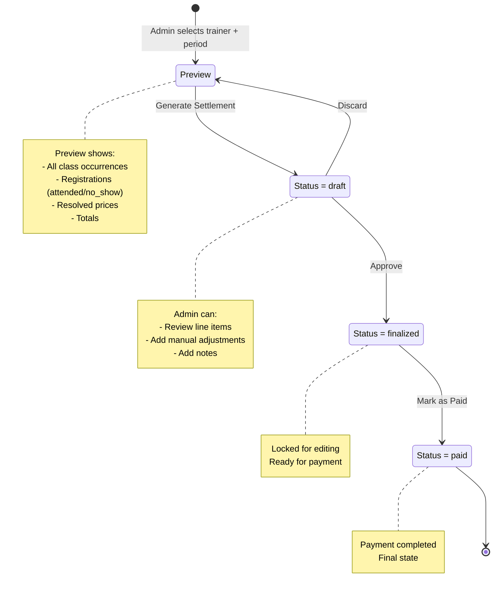
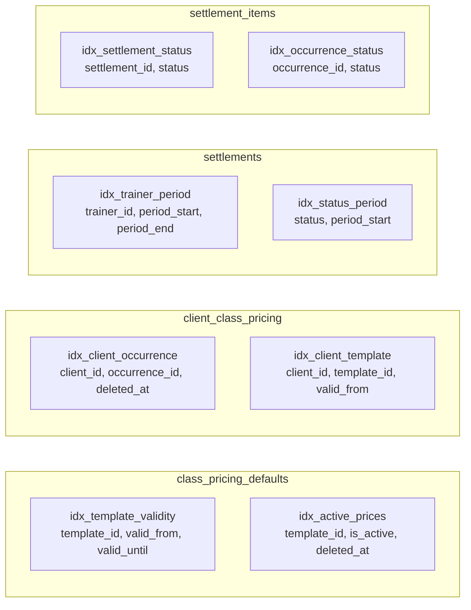
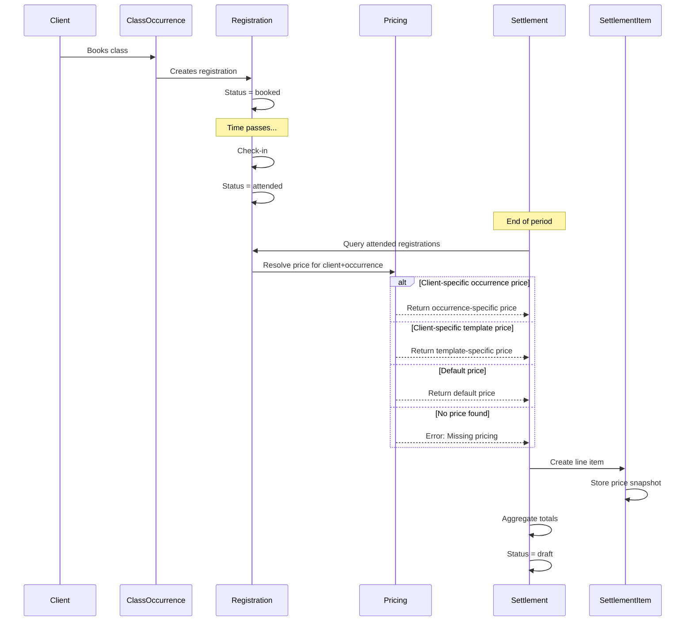

# Settlement & Pricing Module - Entity Relationship Diagram

## Mermaid ER Diagram

## Price Resolution Flow Diagram

## Settlement Generation Workflow

## Key Indexes Visualization

## Data Flow: From Booking to Settlement

## Database Constraints Summary

| Table | Foreign Keys | Cascading Rules | Soft Delete |
|-------|-------------|-----------------|-------------|
| class_pricing_defaults | class_template_id → class_templates | ON DELETE RESTRICT | Yes |
| client_class_pricing | client_id → clients class_template_id → class_templates class_occurrence_id → class_occurrences | ON DELETE CASCADE (all) | Yes |
| settlements | trainer_id → users | ON DELETE RESTRICT | Yes |
| settlement_items | settlement_id → settlements class_occurrence_id → class_occurrences client_id → clients registration_id → class_registrations | ON DELETE CASCADE (settlement_id) ON DELETE RESTRICT (others) | No |

## Cardinality Legend

- `||--o{` : One-to-Many
- One class_template has many class_pricing_defaults (price history)
- One client has many client_class_pricing records (multiple custom prices)
- One settlement has many settlement_items (line items)
- One class_occurrence can be in many settlement_items (multiple clients)
- One class_registration links to zero or one settlement_item (if settled)

---

**Generated:** 2025-12-08
**Diagrams Format:** Mermaid (compatible with GitHub, GitLab, VS Code)
